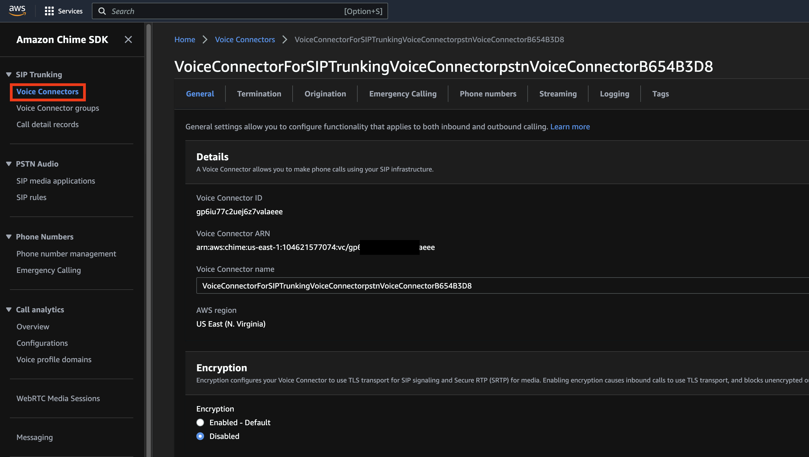
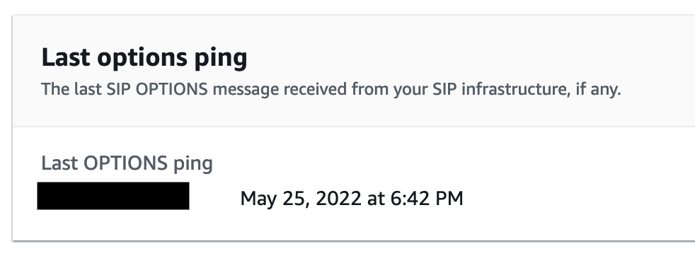
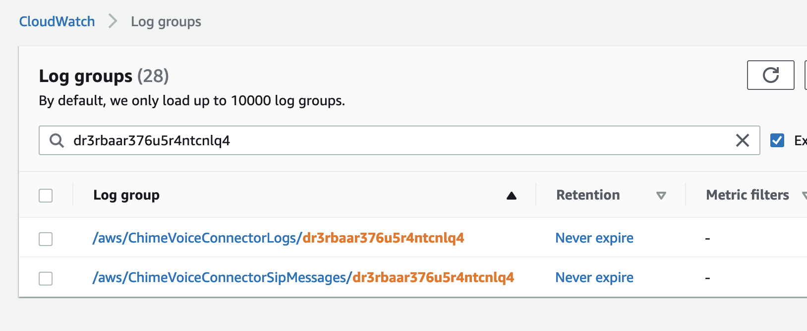
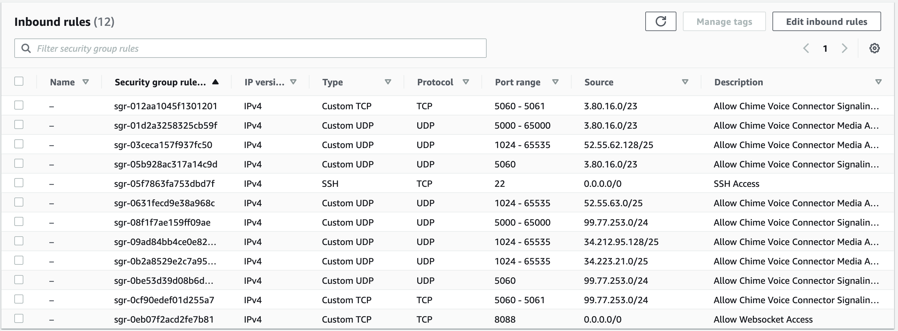
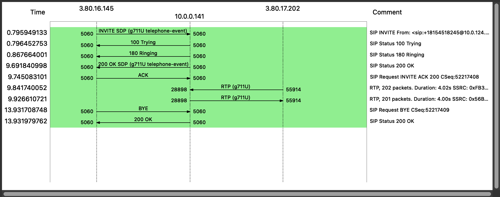

## Amazon Chime SDK Voice Connector for SIP Trunking

## Overview


This demo will deploy and configure an Amazon Chime SDK Voice Connector and an Elastic Compute Cloud (Amazon EC2) instance. This Amazon EC2 instance is deployed to run an [Asterisk](https://www.asterisk.org/) IP Private Branch Exchange (IPPBX) which can be used to make and receive calls from the Public Switched Telephone Network (PSTN) using the [SIP Trunk](https://aws.amazon.com/chime/chime-sdk/features/) feature of Amazon Chime SDK. In this demo, we'll be using an Asterisk IPPBX, but many other IPPBXs can be used as described in the [Configuration Guides](https://aws.amazon.com/chime/chime-sdk/resources/). This Asterisk IPPBX will be configured to use a web client phone that can be used to make and receive calls without installing a softphone.

## How It Works

As part of this deployment, an Amazon Chime SDK Voice Connector is created. This can be seen and configured in the [Amazon Chime Console](https://console.chime.aws.amazon.com). The VoiceConnectorId will be used in this README and can be loaded as a variable using the CDK output: `VOICECONNECTORID=` command.



This shows an Amazon Chime SDK Voice Connector configured in `us-east-1` without encryption. This demo does not use TLS/SRTP encryption but can be added to a production SIP trunk.

### Termination

Termination refers to the configuration applied for calls made from the IPPBX to the Amazon Chime SDK Voice Connector. This configuration can be seen in the Amazon Chime SDK Console under Termination or from the [Command Line Interface](https://aws.amazon.com/cli/) (AWS CLI).

In this deployment, an example output from this command `aws chime get-voice-connector-termination --voice-connector-id $VOICECONNECTORID` would look like this:

```
{
    "Termination": {
        "CpsLimit": 1,
        "CallingRegions": [
            "US"
        ],
        "CidrAllowedList": [
            "198.51.100.204/32"
        ],
        "Disabled": false
    }
}
```

This indicates that the Amazon Chime SDK Voice Connector will accept calls from a single IP address (198.51.100.204/32) and will allow calling to US numbers. Calls to other country numbers will be rejected. Calls from other IP addresses will also be rejected.

Within the Amazon Chime SDK Console, the SIP OPTIONs status can also be seen.



This indicates when the last SIP OPTIONS message was received from the IP address listed. This can be useful to determine if your SIP endpoint is able to send SIP traffic to the Amazon Chime SDK Voice Connector.

Within the Asterisk server, this is configured in the `pjsip.conf` file:

```asterisk
[PSTNVoiceConnector]
type=aor
contact=sip:dr3rbaar376u5r4ntcnlq4.voiceconnector.chime.aws
qualify_frequency=30
```

### Origination

Origination refers to the configuration applied for calls made to the IPPBX from the Amazon Chime SDK Voice Connector. This configuration can be seen in the Amazon Chime Console under Origination or from the AWS CLI command: `aws chime get-voice-connector-origination --voice-connector-id $VOICECONNECTORID`

In this deployment, an example of the output will look like this:

```
{
    "Origination": {
        "Routes": [
            {
                "Host": "198.51.100.204",
                "Port": 5060,
                "Protocol": "UDP",
                "Priority": 1,
                "Weight": 1
            }
        ],
        "Disabled": false
    }
}
```

This configuration indicates that a single route is configured for this Amazon Chime SDK Voice Connector. This route will send traffic to IP address 198.51.100.204 on port 5060 using the UDP protocol. This configuration is typical for a single target, unencrypted SIP trunk.

Up to 10 routes can be added to a single Origination. These routes can be configured with different Priority and Weight. Within a single Priority, calls will be routed to Weights proportionally. For example:

```
{
    "Origination": {
        "Routes": [
            {
                "Host": "198.51.100.204",
                "Priority": 1,
                "Weight": 5
            },
            {
                "Host": "198.51.100.205",
                "Priority": 1,
                "Weight": 5
            },
            {
                "Host": "198.51.100.206",
                "Priority": 2,
                "Weight": 1
            },
            {
                "Host": "198.51.100.207",
                "Priority": 2,
                "Weight": 9
            }
        ],
    }
}
```

This would result in two Priority groups. In the first Priority group (1), calls would be evenly distributed between 198.51.100.204 and 198.51.100.205. If calls failed to both of these IP addresses, the routes in the next Priority group (2) would be used. In this Priority group, 10% of the calls would be sent to 198.51.100.206 and 90% would be sent to 198.51.100.207.

### Logging

In the Logging tab, it is recommended that SIP message and media metric logging is enabled. These logs can be found in Amazon CloudWatch:



More information on the logs generated by Amazon Chime SDK Voice Connector can be found [here](https://docs.aws.amazon.com/chime/latest/ag/monitoring-cloudwatch.html#cw-logs)

### Networking

Amazon Chime SDK Voice Connector uses a range of IPs, Ports, and Protocols. These should be allow listed in any firewall between the Amazon Chime SDK Voice Connector and SIP target. These IPs and Ports can be found [here](https://docs.aws.amazon.com/chime-sdk/latest/ag/network-config.html#cvc). In this demo, these IPs and Ports are configured in the associated Security Group in the Inbound Rules.



## SIP Messaging

### Connecting to Asterisk

In order to see SIP messages sent between the Amazon Chime SDK Voice Connector and the IPPBX, you can log in to the Asterisk using AWS Systems Manager. The CDK output includes a command similar to this: `aws ssm start-session --target i-0af203a984c99de58` that can be used to connect to the EC2 instance.

Once logged in:

```bash
sudo bash
cd /etc/asterisk
asterisk -crvvvvv
```

Within the Asterisk console: `pjsip set logger on`

This will display SIP messages in the Asterisk console while calls are being made. These SIP messages comply with [RFC 3261](https://datatracker.ietf.org/doc/html/rfc3261).

### Inbound Call - PSTN -> IPPBX

Example INVITE

```sip
<--- Received SIP request (953 bytes) from UDP:3.80.16.13:5060 --->
INVITE sip:+16185558387@198.51.100.204:5060;transport=UDP SIP/2.0
Record-Route: <sip:3.80.16.13;lr;ftag=9eXmFya9j7Hpa;did=c71.2ee3;nat=yes>
Via: SIP/2.0/UDP 3.80.16.13:5060;branch=z9hG4bKec37.25cad5b1953f730a93ea935c0ab48f61.0
Via: SIP/2.0/UDP 10.0.58.47;received=10.0.58.47;rport=5060;branch=z9hG4bKBa834aZp7Hy1r
Max-Forwards: 69
From: <sip:+18155558245@10.0.58.47:5060>;tag=9eXmFya9j7Hpa
To: <sip:+16185558387@198.51.100.204:5060>;transport=UDP
Call-ID: 39d6b15a-7688-4263-85ec-8409291a2b21
CSeq: 52215685 INVITE
Contact: <sip:10.0.58.47:5060;alias=10.0.58.47~5060~1>
Content-Type: application/sdp
Content-Length: 247
X-VoiceConnector-ID: dr3rbaar376u5r4ntcnlq4
User-Agent: VineProx-v2.3

v=0
o=Sonus_UAC 546642 315470 IN IP4 3.80.17.149
s=SIP Media Capabilities
c=IN IP4 3.80.17.149
t=0 0
m=audio 36488 RTP/AVP 0 101
a=rtpmap:0 PCMU/8000
a=rtpmap:101 telephone-event/8000
a=fmtp:101 0-15
a=sendrecv
a=rtcp:36489
a=ptime:20
```

This INVITE represents a call from +16185558387 to +18155558245. This INVITE was sent from 3.80.16.13:5060 to 198.51.100.204:5060 using UDP.

```
<--- Received SIP request (953 bytes) from UDP:3.80.16.13:5060 --->
INVITE sip:+16185558387@198.51.100.204:5060;transport=UDP SIP/2.0
From: <sip:+18155558245@10.0.58.47:5060>;tag=9eXmFya9j7Hpa
To: <sip:+16185558387@198.51.100.204:5060>;transport=UDP
```

As part of the SIP INVITE, [Session Description Protocol](https://datatracker.ietf.org/doc/html/rfc4566) (SDP) is used to negotiate the Real-time Transport Protocol (RTP). In this INVITE, the `c=IN IP4 3.80.17.149` defines the IP address that media will be sent from. The `m=audio 36488 RTP/AVP 0 101` line offers a single codec - G711μ (0) using port 36488. Additionally, [RFC 2833](https://datatracker.ietf.org/doc/html/rfc2833) is offered (101) for Dual tone multi-frequency (DTMF). This IP address and Port must be allowed through to the SIP endpoint for media to pass from the Amazon Chime SDK Voice Connector to the IPPBX.

```
c=IN IP4 3.80.17.149
m=audio 36488 RTP/AVP 0 101
a=rtpmap:0 PCMU/8000
a=rtpmap:101 telephone-event/8000
a=fmtp:101 0-15
a=sendrecv
a=rtcp:36489
a=ptime:20
```

This SDP also includes RTP Control Protocol (RTCP). RTCP is used to capture RTP statistics and is used to populate the Cloudwatch logs. It is recommended that RTCP is enabled for SIP endpoints.

### Outbound Call - IPPBX -> PSTN

Example INVITE

```
<--- Transmitting SIP request (1413 bytes) to UDP:198.51.100.204:5060 --->
INVITE sip:+18155558245@dr3rbaar376u5r4ntcnlq4.voiceconnector.chime.aws SIP/2.0
Via: SIP/2.0/UDP 198.51.100.204:5060;rport;branch=z9hG4bKPjb46638db-f05f-44fb-8644-86438687c288
From: <sip:+16185558387@10.0.0.141>;tag=8b29e8c9-8801-44fb-b876-5622a69dcb5c
To: <sip:+18155558245@dr3rbaar376u5r4ntcnlq4.voiceconnector.chime.aws>
Contact: <sip:asterisk@198.51.100.204:5060>
Call-ID: a9a4f1ca-3a31-4044-b832-1483289c7963
CSeq: 23513 INVITE
Allow: OPTIONS, REGISTER, SUBSCRIBE, NOTIFY, PUBLISH, INVITE, ACK, BYE, CANCEL, UPDATE, PRACK, MESSAGE, REFER
Supported: 100rel, timer, replaces, norefersub, histinfo
Session-Expires: 1800
Min-SE: 90
Max-Forwards: 70
User-Agent: Asterisk PBX 18.12.1
Content-Type: application/sdp
Content-Length:   661

v=0
o=- 1270113147 1270113147 IN IP4 44.205.172.204
s=Asterisk
c=IN IP4 198.51.100.204
t=0 0
m=audio 25388 RTP/AVP 0 101
a=ice-ufrag:62a994f0387b370a01fd6db86aa272a5
a=ice-pwd:5013deae0dfe51a06340484f367ea602
a=candidate:Ha00008d 1 UDP 2130706431 10.0.0.141 25388 typ host
a=candidate:S2ccdaccc 1 UDP 1694498815 198.51.100.204 25388 typ srflx raddr 10.0.0.141 rport 25388
a=candidate:Ha00008d 2 UDP 2130706430 10.0.0.141 25389 typ host
a=candidate:S2ccdaccc 2 UDP 1694498814 198.51.100.204 25389 typ srflx raddr 10.0.0.141 rport 25389
a=rtpmap:0 PCMU/8000
a=rtpmap:101 telephone-event/8000
a=fmtp:101 0-16
a=ptime:20
a=maxptime:150
a=sendrecv
```

This INVITE represents a call from +16185558387 to +18155558245. This INVITE was sent from 198.51.100.204:5060 to 198.51.100.204:5060 using UDP.

```
<--- Transmitting SIP request (1413 bytes) to UDP:198.51.100.204:5060 --->
INVITE sip:+18155558245@dr3rbaar376u5r4ntcnlq4.voiceconnector.chime.aws SIP/2.0 :arrow_left:
From: <sip:+16185558387@10.0.0.141>;tag=8b29e8c9-8801-44fb-b876-5622a69dcb5c
To: <sip:+18155558245@dr3rbaar376u5r4ntcnlq4.voiceconnector.chime.aws>
```

An INVITE sent to Amazon Chime SDK Voice Connector should use E.164 addressing using a FROM number in the Amazon Chime Phone Inventory and should include the Amazon Chime SDK Voice Connector ID in the URI.

### Packet Captures

In addition to logs captured from Asterisk, [tshark](https://www.wireshark.org/docs/man-pages/tshark.html) can be used for more detailed packet captures. From the Asterisk server: `tshark -f 'udp'` to capture UDP packets in real time. If using UDP on the Amazon Chime SDK Voice Connector, this filter will display both SIP and RTP. To save this information to a file and download: `tshark -f 'udp' -w /tmp/capture.pcap`

After downloading this capture, it can be viewed in [Wireshark](https://www.wireshark.org/) to see the call flow between the IPPBX and Amazon Chime SDK Voice Connector. This can be used to further troubleshoot calls.



### Client

A CloudFront Distribution has been deployed with this CDK. That Distribution can be used to access a soft phone that is being served from the EC2 instance. This simple client can be used to make and receive calls.


## What Is Deployed

- Amazon Chime SDK Voice Connector - PSTN Access w/DID
- Virtual Private Cloud (Amazon VPC)
  - Amazon EC2 - Asterisk Server
  - Elastic IP
  - Security Group
  - Application Load Balancer
- Cloudfront Distribution

## How To Use

### Requirements

- [Nodev12+](https://nodejs.org/en/download/) installed
- [yarn](https://yarnpkg.com/getting-started/install) installed
- AWS Account with approriate permissions
- [Service Quota](https://us-east-1.console.aws.amazon.com/servicequotas/home/services/chime/quotas) allowance for Phone Numbers

```
yarn launch
```

### Cleanup

```
yarn destroy
```
